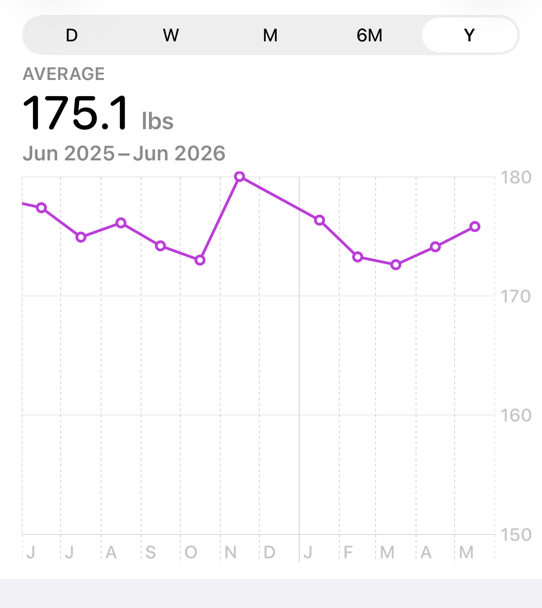
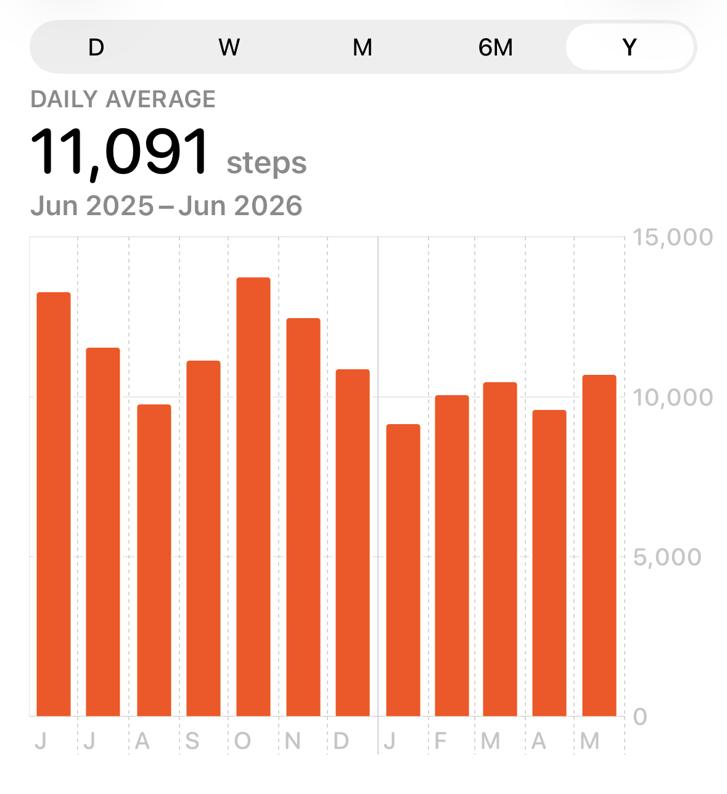
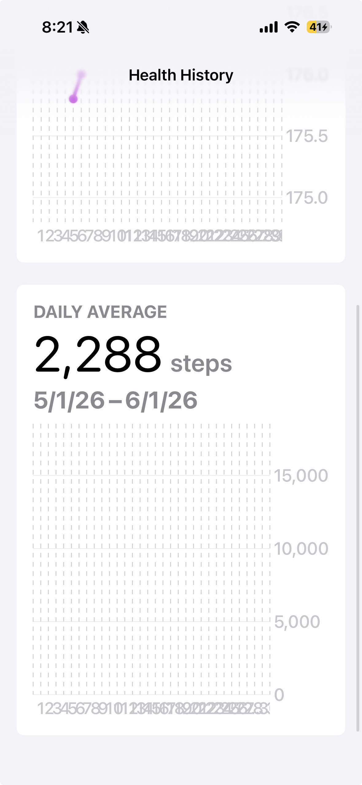
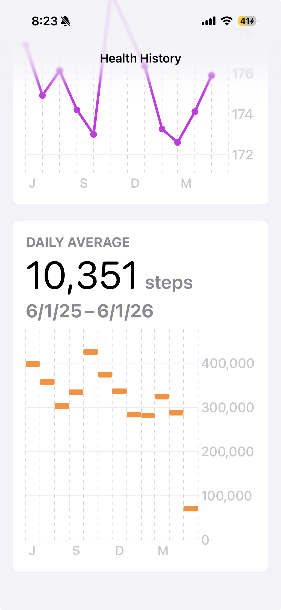
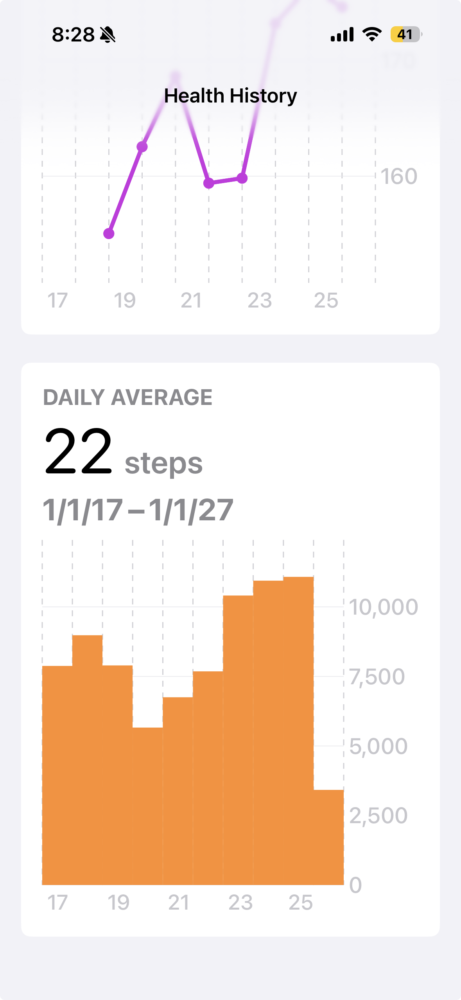
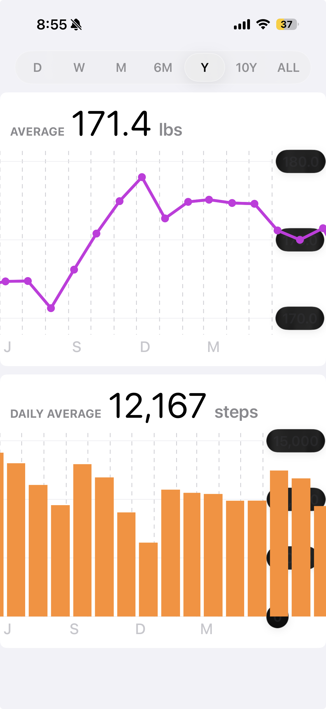
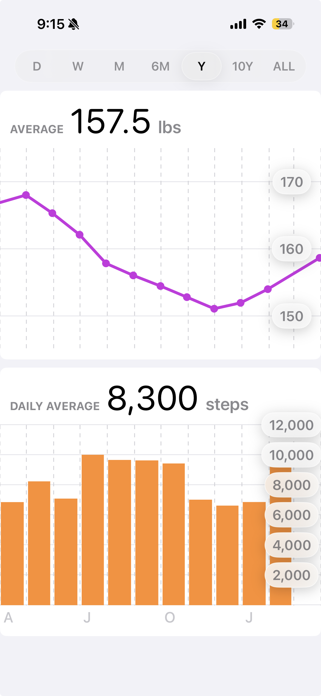

# Add health charts and decade range

> the ios health app shows a weight chart and steps chart over time. weight is a line chart, steps is a bar chart. both have 5 time range options: day, week, month, 6 month, year. implement the same thing, and politely request health data access in order to accomplish it. and add an additional time range option: decade, showing a 10 year range at a time. note the charts can be dragged left and right to adjust which range is showing.
>
> User context
>
> Images:
> - 
> - 

<details><summary>19 previous messages</summary>

> I’ll inspect the app structure and existing HealthKit/data/chart patterns first, then wire the UI into the native data permissions and chart range behavior.
>
> <details><summary>Ran 2 commands</summary>
>
> - Ran `git status --short`
> - Ran `pwd && rg --files -g '!*DerivedData*' -g '!build' -g '!Pods' -g '!node_modules'`
>
> </details>
>
> This is a small SwiftUI project, so I’m reading the main view and project settings before editing. I’m looking for whether HealthKit is already linked and what deployment target/features are available.
>
> <details><summary>Explored 2 files, 1 search</summary>
>
> - Read `./Health History/ContentView.swift`
> - Read `./Health History/Health_HistoryApp.swift`
> - Searched for `HealthKit|INFOPLIST|IPHONEOS_DEPLOYMENT_TARGET|PRODUCT_BUNDLE_IDENTIFIER|FRAMEWORKS|SystemCapabilities` in `project.pbxproj`
>
> </details>
>
> The app is still at the starter view. I’m going to add a HealthKit-backed model, a reusable Health-style chart view, the six range controls including decade, and the required HealthKit permission copy/entitlement in the project.
>
> <details><summary>Explored 2 files</summary>
>
> - Read `./Health History.xcodeproj/project.pbxproj`
> - Read `./Health History.xcodeproj/project.pbxproj`
>
> </details>
>
> I’m making the implementation self-contained in `ContentView.swift` for this small starter app: HealthKit access, range math, aggregation queries, and the two chart cards. I’ll also add the HealthKit entitlement and privacy string so the system permission sheet can be shown correctly.
>
> <details><summary>Created 2 files, edited 1 file, deleted 1 file</summary>
>
> - Deleted `./Health History/ContentView.swift` (+0 -24)
> - Wrote `./Health History/ContentView.swift` (+484 -0)
> - Wrote `./Health History/Health History.entitlements` (+8 -0)
> - Wrote `./Health History.xcodeproj/project.pbxproj` (+9 -0)
>
> </details>
>
> The first pass is in place. I’m building now to catch Swift/Charts/HealthKit API issues, then I’ll tighten any compile errors instead of guessing.
>
> <details><summary>Ran 1 command</summary>
>
> - Ran `xcodebuild -project 'Health History.xcodeproj' -scheme 'Health History' -destination 'generic/platform=iOS' build`
>
> </details>
>
> The build is running with the local Xcode toolchain. While it runs, I’m watching for entitlement/signing problems separately from code problems because HealthKit often fails at project configuration first.
>
> The device build reached signing and provisioning, not Swift compilation: this team profile doesn’t include HealthKit and no matching iOS Development certificate is installed. I’m switching to a simulator/no-sign build to verify the code path itself.
>
> <details><summary>Ran 1 command</summary>
>
> - Ran `xcodebuild -project 'Health History.xcodeproj' -scheme 'Health History' -destination 'generic/platform=iOS Simulator' CODE_SIGNING_ALLOWED=NO build`
>
> </details>
>
> The simulator build got to Swift and found a straightforward missing `Combine` import for `ObservableObject`/`@Published`. I’m fixing that and rerunning the same no-sign simulator build.
>
> <details><summary>Edited 1 file, ran 1 command</summary>
>
> - Wrote `./Health History/ContentView.swift` (+1 -0)
> - Ran `xcodebuild -project 'Health History.xcodeproj' -scheme 'Health History' -destination 'generic/platform=iOS Simulator' CODE_SIGNING_ALLOWED=NO build`
>
> </details>
>
> The code now compiles for the simulator. I’m making one behavioral adjustment before wrapping up: the app should show the polite in-app explanation first, and only open the Health permission sheet after the user taps the access button.
>
> <details><summary>Edited 1 file</summary>
>
> - Wrote `./Health History/ContentView.swift` (+5 -1)
>
> </details>
>
> I’m running one final simulator build after the permission-flow adjustment, then I’ll summarize exactly what changed and the remaining real-device signing requirement.
>
> <details><summary>Ran 3 commands</summary>
>
> - Ran `xcodebuild -project 'Health History.xcodeproj' -scheme 'Health History' -destination 'generic/platform=iOS Simulator' CODE_SIGNING_ALLOWED=NO build`
> - Ran `git status --short`
> - Ran `git diff -- 'Health History/ContentView.swift' 'Health History/Health History.entitlements' 'Health History.xcodeproj/project.pbxproj'`
>
> </details>
</details>

Implemented the Health-style charts in [ContentView.swift](~/Development/Health%20History/Health%20History/ContentView.swift):

- Weight line chart and steps bar chart using Swift Charts.
- Range picker: `D`, `W`, `M`, `6M`, `Y`, `10Y`.
- Horizontal drag shifts the visible date window left/right.
- Read-only HealthKit access request with an in-app explanation before showing the system prompt.
- HealthKit queries for body mass and step count, aggregated per selected range.

Also added HealthKit configuration:

- [Health History.entitlements](~/Development/Health%20History/Health%20History/Health%20History.entitlements)
- HealthKit capability and `NSHealthShareUsageDescription` in [project.pbxproj](~/Development/Health%20History/Health%20History.xcodeproj/project.pbxproj)

Verification: `xcodebuild -project 'Health History.xcodeproj' -scheme 'Health History' -destination 'generic/platform=iOS Simulator' CODE_SIGNING_ALLOWED=NO build` succeeds.

Real-device build is currently blocked by signing/provisioning: the active team profile does not include HealthKit, and no matching iOS Development certificate was found. You’ll need a provisioning profile with the HealthKit capability enabled to run this on device.

> change the bundle identifer to co.dn5.HealthHistory

<details><summary>16 previous messages</summary>

> I’ll update the target bundle identifier in the Xcode project and run a quick no-sign simulator build to make sure the project still parses and compiles.
>
> <details><summary>Explored 1 search</summary>
>
> - Searched for `PRODUCT_BUNDLE_IDENTIFIER|co\.dn5\.Health` in `project.pbxproj`
>
> </details>
>
> I found the bundle ID in both Debug and Release build settings. I’m changing only those project settings.
>
> <details><summary>Edited 1 file</summary>
>
> - Wrote `./Health History.xcodeproj/project.pbxproj` (+2 -2)
>
> </details>
>
> The identifier is changed. I’m rebuilding the simulator target with signing disabled to catch any project file issues.
>
> <details><summary>Ran 1 command</summary>
>
> - Ran `xcodebuild -project 'Health History.xcodeproj' -scheme 'Health History' -destination 'generic/platform=iOS Simulator' CODE_SIGNING_ALLOWED=NO build`
>
> </details>
>
> The project file accepted the edit, but this Xcode invocation now isn’t seeing the user scheme by name. I’m checking the scheme list before deciding whether this is a verification-command issue or a project issue.
>
> <details><summary>Ran 1 command</summary>
>
> - Ran `xcodebuild -list -project 'Health History.xcodeproj'`
>
> </details>
>
> Xcode now lists the scheme as `HealthHistory`, so the failure was from using the old scheme name in verification. I’m building with the listed scheme.
>
> <details><summary>Ran 1 command</summary>
>
> - Ran `xcodebuild -project 'Health History.xcodeproj' -scheme HealthHistory -destination 'generic/platform=iOS Simulator' CODE_SIGNING_ALLOWED=NO build`
>
> </details>
>
> That run hit a transient DerivedData build database lock, which usually means Xcode still had cleanup work from the prior failed invocation. I’m checking for active builds and then rerunning with a separate derived data path to avoid the lock.
>
> <details><summary>Ran 2 commands</summary>
>
> - Ran `git diff -- 'Health History.xcodeproj/project.pbxproj'`
> - Ran `pgrep -af xcodebuild`
>
> </details>
>
> The diff shows Xcode also rewrote target/product display names to `HealthHistory` while inspecting the project. That is outside the requested bundle ID change, so I’m restoring the target/app name comments/settings and keeping only `PRODUCT_BUNDLE_IDENTIFIER = co.dn5.HealthHistory`.
>
> <details><summary>Edited 1 file, explored 1 search, ran 1 command</summary>
>
> - Wrote `./Health History.xcodeproj/project.pbxproj` (+8 -8)
>
> <details><summary>Explored 1 search</summary>
>
> - Searched for `PRODUCT_BUNDLE_IDENTIFIER|HealthHistory|Health-History` in `project.pbxproj`
>
> </details>
>
> - Ran `xcodebuild -list -project 'Health History.xcodeproj'`
>
> </details>
>
> The target and scheme are back to `Health History`, and `rg` confirms the only `HealthHistory` string left is the requested bundle identifier. I’m doing the final build with a temporary DerivedData path to avoid the locked/permissioned Xcode cache.
>
> <details><summary>Ran 1 command</summary>
>
> - Ran `xcodebuild -project 'Health History.xcodeproj' -scheme 'Health History' -destination 'generic/platform=iOS Simulator' -derivedDataPath /private/tmp/HealthHistoryBuild CODE_SIGNING_ALLOWED=NO build`
>
> </details>
</details>

Changed the bundle identifier to `co.dn5.HealthHistory` in both Debug and Release settings in [project.pbxproj](~/Development/Health%20History/Health%20History.xcodeproj/project.pbxproj).

Verification passed with:

`xcodebuild -project 'Health History.xcodeproj' -scheme 'Health History' -destination 'generic/platform=iOS Simulator' -derivedDataPath /private/tmp/HealthHistoryBuild CODE_SIGNING_ALLOWED=NO build`

> scale the weight chart y axis to the active value range

<details><summary>12 previous messages</summary>

> I’ll adjust the weight chart to compute its y-domain from the visible data instead of letting the axis span a broad default range, while leaving the steps bars anchored to zero.
>
> <details><summary>Explored 1 search</summary>
>
> - Searched for `HealthMetricChart|chartY|chartXScale|style: \.line|style: \.bar` in `ContentView.swift`
>
> </details>
>
> The chart component is shared, so I’m adding y-domain behavior to the style itself: line charts get a padded data range, bar charts keep their current baseline behavior.
>
> <details><summary>Explored 2 files</summary>
>
> - Read `./Health History/ContentView.swift`
> - Read `./Health History/ContentView.swift`
>
> </details>
>
> I’m making the y-axis domain explicit only when the line chart has data. The padding is proportional to the visible spread, with a small fallback when all values are nearly identical.
>
> <details><summary>Edited 1 file</summary>
>
> - Wrote `./Health History/ContentView.swift` (+16 -0)
>
> </details>
>
> The edit is in. I’m building now because Swift Charts modifiers are particular about optional domains, and I want to verify this compiles cleanly.
>
> <details><summary>Ran 1 command</summary>
>
> - Ran `xcodebuild -project 'Health History.xcodeproj' -scheme 'Health History' -destination 'generic/platform=iOS Simulator' -derivedDataPath /private/tmp/HealthHistoryBuild CODE_SIGNING_ALLOWED=NO build`
>
> </details>
>
> As expected, Charts won’t accept an optional domain. I’m changing that helper to always return a concrete range: weight uses the active min/max, steps use `0...max` with headroom.
>
> <details><summary>Edited 1 file</summary>
>
> - Wrote `./Health History/ContentView.swift` (+13 -8)
>
> </details>
>
> The y-domain helper is now concrete and style-aware. I’m rerunning the same simulator build to confirm.
>
> <details><summary>Ran 1 command</summary>
>
> - Ran `xcodebuild -project 'Health History.xcodeproj' -scheme 'Health History' -destination 'generic/platform=iOS Simulator' -derivedDataPath /private/tmp/HealthHistoryBuild CODE_SIGNING_ALLOWED=NO build`
>
> </details>
</details>

Updated the chart scaling in [ContentView.swift](~/Development/Health%20History/Health%20History/ContentView.swift) so the weight line chart’s y-axis now uses the active visible data range with padding, instead of a broad default scale.

Steps still keep a zero baseline with a little headroom, which is appropriate for bars.

Verification passed with the simulator no-sign build.

> steps chart is not showing any bars

<details><summary>6 previous messages</summary>

> I’ll trace the step query and chart scaling path first. The likely issue is either the HealthKit bucket anchoring for steps or the bar y-domain treating empty/zero values in a way that leaves nothing visible.
>
> <details><summary>Explored 1 file, ran 1 command</summary>
>
> <details><summary>Explored 2 files</summary>
>
> - Read `./Health History/ContentView.swift`
> - Read `./Health History/ContentView.swift`
>
> </details>
>
> - Ran `git status --short`
>
> </details>
>
> The query is producing bucketed points, but the bar mark is using a single `Date` x-value plus a ratio width on a continuous date axis. That can collapse bars down to effectively invisible slivers. I’m switching bars to span each bucket with `xStart`/`xEnd`, which matches the time-range model.
>
> <details><summary>Edited 1 file</summary>
>
> - Wrote `./Health History/ContentView.swift` (+11 -4)
>
> </details>
>
> The bar geometry now spans from each statistics bucket start to its bucket end. I’m building to verify the Swift Charts initializer and the updated data model compile cleanly.
>
> <details><summary>Ran 1 command</summary>
>
> - Ran `xcodebuild -project 'Health History.xcodeproj' -scheme 'Health History' -destination 'generic/platform=iOS Simulator' -derivedDataPath /private/tmp/HealthHistoryBuild CODE_SIGNING_ALLOWED=NO build`
>
> </details>
</details>

Fixed the steps chart bar rendering in [ContentView.swift](~/Development/Health%20History/Health%20History/ContentView.swift).

The issue was that each bar was plotted at a single date on a continuous date axis, so the bars could collapse into near-invisible slivers. Bars now span each HealthKit statistics bucket with `xStart` and `xEnd`, so day/week/month/year ranges should render visible bars.

Verification passed with the no-sign simulator build.

> the x axes have too many labels in many zoom states
>
> User context
>
> Images:
> - 

<details><summary>4 previous messages</summary>

> I’ll separate grid density from label density. The charts can keep useful vertical guide lines, but the x-axis labels need coarser strides per range so month and similar views don’t print every bucket number.
>
> <details><summary>Edited 1 file</summary>
>
> - Wrote `./Health History/ContentView.swift` (+35 -1)
>
> </details>
>
> The x-axis now has separate strides for grid lines and labels. I’m running the simulator build to verify Swift Charts accepts the computed stride values.
>
> <details><summary>Ran 1 command</summary>
>
> - Ran `xcodebuild -project 'Health History.xcodeproj' -scheme 'Health History' -destination 'generic/platform=iOS Simulator' -derivedDataPath /private/tmp/HealthHistoryBuild CODE_SIGNING_ALLOWED=NO build`
>
> </details>
</details>

Reduced x-axis label density in [ContentView.swift](~/Development/Health%20History/Health%20History/ContentView.swift).

The chart now uses separate strides for grid lines and labels:

- Day: labels every 6 hours
- Week: daily labels
- Month: labels every 7 days
- 6M: monthly labels
- Year: quarterly labels
- Decade: labels every 2 years

Grid lines can still remain more frequent, but labels should no longer pile up. Build passed with the no-sign simulator target.

> the bars are not bars at all. they need to start at 0 and go up to the value. also, the step chart is showing total steps for the bar's range, i.e. hundreds of thousands of steps per bar. have them always show daily average instead of total.
>
> User context
>
> Images:
> - 

<details><summary>10 previous messages</summary>

> I’ll change the step data before it reaches the chart, not just the rendering. Step buckets will be normalized to per-day averages, and the bar mark will explicitly draw from `0` up to that value.
>
> <details><summary>Edited 1 file, explored 1 search</summary>
>
> <details><summary>Explored 1 search</summary>
>
> - Searched for `statistics\(|loadedSteps|BarMark|ChartPoint` in `ContentView.swift`
>
> </details>
>
> - Wrote `./Health History/ContentView.swift` (+14 -4)
>
> </details>
>
> Step buckets are now converted from bucket totals to per-day averages during HealthKit result mapping. I’m fixing the bar mark next so it uses a real zero baseline.
>
> <details><summary>Edited 1 file</summary>
>
> - Wrote `./Health History/ContentView.swift` (+2 -1)
>
> </details>
>
> The bars now use `yStart: 0` and `yEnd: value`, so they should render as vertical columns from the baseline. I’m building to verify the Charts initializer is correct.
>
> <details><summary>Ran 1 command</summary>
>
> - Ran `xcodebuild -project 'Health History.xcodeproj' -scheme 'Health History' -destination 'generic/platform=iOS Simulator' -derivedDataPath /private/tmp/HealthHistoryBuild CODE_SIGNING_ALLOWED=NO build`
>
> </details>
>
> The build found two API details: the range-based vertical shape should be `RectangleMark`, and the HealthKit enumeration closure needs explicit `self.calendar`. I’m applying both corrections now.
>
> <details><summary>Edited 1 file</summary>
>
> - Wrote `./Health History/ContentView.swift` (+2 -2)
>
> </details>
>
> The chart now uses `RectangleMark` for bucket-width columns, with `yStart` at zero and `yEnd` at the daily-average value. I’m rerunning the build.
>
> <details><summary>Ran 1 command</summary>
>
> - Ran `xcodebuild -project 'Health History.xcodeproj' -scheme 'Health History' -destination 'generic/platform=iOS Simulator' -derivedDataPath /private/tmp/HealthHistoryBuild CODE_SIGNING_ALLOWED=NO build`
>
> </details>
</details>

Fixed both issues in [ContentView.swift](~/Development/Health%20History/Health%20History/ContentView.swift).

Steps now:

- Render as true vertical bars from `0` to the value using `RectangleMark`.
- Normalize each bucket to a daily average, so month/week/year buckets no longer show total steps for the whole bucket.
- Keep the chart summary as daily average across the visible range.

Build passed with the no-sign simulator target.

> keep the range tabs pinned to the top of the screen so i can swtich when scrolled down to the bottom. fix the daily average calculation on steps, it's clearly wrong.
>
> User context
>
> Images:
> - 

<details><summary>8 previous messages</summary>

> I’ll fix this in two places: move the segmented range control outside the scroll view so it stays pinned, and change the steps summary math so it averages the already-normalized daily step buckets instead of dividing them by the whole interval again.
>
> <details><summary>Explored 1 file</summary>
>
> - Read `./Health History/ContentView.swift`
>
> </details>
>
> The step summary bug is from using the chart values after they were normalized per bucket, then dividing those values by the full range again. I’m keeping raw totals on each point so the visible summary can be computed as `total steps / days in visible range`, while the bars can still display per-day bucket averages.
>
> <details><summary>Edited 1 file</summary>
>
> - Wrote `./Health History/ContentView.swift` (+4 -2)
>
> </details>
>
> The data model now preserves raw step totals for summary math. I’m moving the segmented control outside the scroll area next so it remains available at the top while the charts scroll underneath.
>
> <details><summary>Edited 1 file</summary>
>
> - Wrote `./Health History/ContentView.swift` (+32 -27)
>
> </details>
>
> The range tabs are now in a fixed header above the scroll view. I’m building now to catch any struct initializer or layout-related compile issues from the data-model change.
>
> <details><summary>Ran 1 command</summary>
>
> - Ran `xcodebuild -project 'Health History.xcodeproj' -scheme 'Health History' -destination 'generic/platform=iOS Simulator' -derivedDataPath /private/tmp/HealthHistoryBuild CODE_SIGNING_ALLOWED=NO build`
>
> </details>
</details>

Done in [ContentView.swift](~/Development/Health%20History/Health%20History/ContentView.swift).

The range tabs are now pinned above the scroll view, so they stay available while you scroll to the bottom.

The steps daily average is fixed by preserving each bucket’s raw step total and computing the summary as `sum(raw steps) / days in visible range`. The bars still display daily-average bucket values, but the headline no longer divides those already-averaged bucket values a second time.

Build passed with the no-sign simulator target.

> have some space between bars in the step chart. they're flush now.

<details><summary>4 previous messages</summary>

> I’ll add the spacing at the mark level by insetting each step bucket’s rendered start/end dates slightly, while keeping the underlying data interval unchanged.
>
> <details><summary>Edited 1 file</summary>
>
> - Wrote `./Health History/ContentView.swift` (+14 -2)
>
> </details>
>
> The step bars now render with an 8% inset on each side of the bucket. I’m running the build to verify the chart still compiles.
>
> <details><summary>Ran 1 command</summary>
>
> - Ran `xcodebuild -project 'Health History.xcodeproj' -scheme 'Health History' -destination 'generic/platform=iOS Simulator' -derivedDataPath /private/tmp/HealthHistoryBuild CODE_SIGNING_ALLOWED=NO build`
>
> </details>
</details>

Added spacing between step bars in [ContentView.swift](~/Development/Health%20History/Health%20History/ContentView.swift).

Each bar now renders slightly inset within its time bucket, so adjacent buckets no longer touch. Build passed with the no-sign simulator target.

> add an ALL tab after 10Y that adjusts the range automatically to the available data. and make dragging horizontally over the charts interactively move the range. right now it just snaps at some point to the next range over. it should be like scrolling a scroll view.

<details><summary>12 previous messages</summary>

> I’ll update the range model and chart gesture together: add `ALL` with HealthKit-derived data bounds, then replace the end-only swipe with a live horizontal drag offset that shifts the visible interval continuously.
>
> <details><summary>Explored 2 files</summary>
>
> - Read `./Health History/ContentView.swift`
> - Read `./Health History/ContentView.swift`
>
> </details>
>
> I found the current range model assumes every tab has a fixed calendar window. I’m adding `ALL` as a data-driven interval in the store, then making `ALL` choose a bucket size from the actual span so it remains readable.
>
> <details><summary>Edited 1 file</summary>
>
> - Wrote `./Health History/ContentView.swift` (+27 -4)
>
> </details>
>
> The enum now has `ALL` and can pick a bucket component for data-driven spans. Next I’m teaching the HealthKit store to discover the first and last available samples across weight and steps.
>
> <details><summary>Edited 1 file</summary>
>
> - Wrote `./Health History/ContentView.swift` (+46 -2)
>
> </details>
>
> `ALL` now gets its date extent from HealthKit sample bounds. I’m replacing the snap gesture with a live drag state that continuously shifts the visible chart interval while your finger moves.
>
> <details><summary>Edited 1 file</summary>
>
> - Wrote `./Health History/ContentView.swift` (+68 -10)
>
> </details>
>
> The drag interaction is now stateful and continuous over each chart. I’m filling in the axis behavior for the new `ALL` tab so the format and label spacing stay reasonable.
>
> <details><summary>Edited 1 file, explored 1 file</summary>
>
> - Wrote `./Health History/ContentView.swift` (+38 -1)
>
> <details><summary>Explored 2 files</summary>
>
> - Read `./Health History/ContentView.swift`
> - Read `./Health History/ContentView.swift`
>
> </details>
>
> </details>
>
> The axis switches are in place. I’m building now; this will catch any Swift Charts or Date.FormatStyle type issues from the new adaptive `ALL` behavior.
>
> <details><summary>Ran 1 command</summary>
>
> - Ran `xcodebuild -project 'Health History.xcodeproj' -scheme 'Health History' -destination 'generic/platform=iOS Simulator' -derivedDataPath /private/tmp/HealthHistoryBuild CODE_SIGNING_ALLOWED=NO build`
>
> </details>
</details>

Implemented both changes in [ContentView.swift](~/Development/Health%20History/Health%20History/ContentView.swift).

`ALL` is now available after `10Y`, using HealthKit sample bounds across weight and steps to choose the full available data range. It also adapts the chart bucket size based on that span.

Horizontal dragging over either chart now moves the visible date range continuously while dragging, instead of snapping one whole range on release. On release, it commits the new anchor date and reloads HealthKit data for that range.

Build passed with the no-sign simulator target.

> right now tapping into 10Y for example takes a while for the UI to update. after rendering the initial view, precalculate in a background thread everything necessary to instantly switch into different range modes.

<details><summary>11 previous messages</summary>

> I’ll add an in-memory range cache inside the HealthKit store, then warm all tabs after the first successful load. Range switches will use cached chart data immediately and only query HealthKit when the cache for that range/window is missing.
>
> <details><summary>Explored 1 file</summary>
>
> - Read `./Health History/ContentView.swift`
>
> </details>
>
> Context compaction
>
> Source: automatic
> Status: completed
>
> I’ll add an in-memory range cache inside the HealthKit store, then warm all tabs after the first successful load. Range switches will use cached chart data immediately and only query HealthKit when the cache for that range/window is missing.
>
> <details><summary>Explored 2 files</summary>
>
> - Read `./Health History/ContentView.swift`
> - Read `./Health History/ContentView.swift`
>
> </details>
>
> I found the current data path: every tab switch calls two HealthKit statistics queries, so long ranges pay that cost on demand. I’m refactoring that into a fetch/apply/cache split and warming the other tabs without changing the visible chart when preload results arrive.
>
> <details><summary>Edited 1 file</summary>
>
> - Wrote `./Health History/ContentView.swift` (+79 -3)
>
> </details>
>
> The cache layer is in place. I’m building now because this touched actor-isolated SwiftUI/HealthKit code, and compiler feedback is the fastest way to catch any concurrency mistakes.
>
> <details><summary>Ran 3 commands</summary>
>
> - Ran `xcodebuild -project 'Health History.xcodeproj' -scheme 'Health History' -destination 'generic/platform=iOS Simulator' -derivedDataPath /private/tmp/HealthHistoryBuild CODE_SIGNING_ALLOWED=NO build`
> - Ran `git diff -- 'Health History/ContentView.swift'`
> - Ran `git status --short`
>
> </details>
>
> The build passed. I’m tightening one edge case now: overlapping tab switches should not let an older HealthKit query finish late and repaint the UI with stale range data.
>
> <details><summary>Edited 1 file, ran 1 command</summary>
>
> - Wrote `./Health History/ContentView.swift` (+12 -2)
> - Ran `xcodebuild -project 'Health History.xcodeproj' -scheme 'Health History' -destination 'generic/platform=iOS Simulator' -derivedDataPath /private/tmp/HealthHistoryBuild CODE_SIGNING_ALLOWED=NO build`
>
> </details>
</details>

Implemented the range preloading in [ContentView.swift](~/Development/Health%20History/Health%20History/ContentView.swift).

What changed:
- Added an in-memory cache for computed chart data per range.
- After the initial visible range loads, the app asynchronously preloads the other tabs (`D`, `W`, `M`, `6M`, `Y`, `10Y`, `ALL`).
- Switching to a cached range now applies data immediately instead of waiting on fresh HealthKit queries.
- Added load sequencing so late HealthKit responses from older tab switches cannot repaint the UI with stale data.

Verification passed:

```sh
xcodebuild -project 'Health History.xcodeproj' -scheme 'Health History' -destination 'generic/platform=iOS Simulator' -derivedDataPath /private/tmp/HealthHistoryBuild CODE_SIGNING_ALLOWED=NO build
```

Build succeeded.

> scrolling down to reveal the steps chart is broken now

<details><summary>4 previous messages</summary>

> I’ll treat this as a regression from the preload work: the initial load is probably kicking off enough main-actor work that vertical scrolling feels stuck while the other ranges warm. I’m going to change the warmup so it yields between ranges and doesn’t compete with immediate UI interaction.
>
> <details><summary>Explored 2 files</summary>
>
> - Read `./Health History/ContentView.swift`
> - Read `./Health History/ContentView.swift`
>
> </details>
>
> There are two likely contributors: preload starts immediately after the first chart appears, and the chart drag recognizer starts on tiny movements. I’m changing both so vertical scroll gets priority and range warmup waits briefly, then works in small chunks.
>
> <details><summary>Edited 1 file, ran 1 command</summary>
>
> - Wrote `./Health History/ContentView.swift` (+7 -3)
> - Ran `xcodebuild -project 'Health History.xcodeproj' -scheme 'Health History' -destination 'generic/platform=iOS Simulator' -derivedDataPath /private/tmp/HealthHistoryBuild CODE_SIGNING_ALLOWED=NO build`
>
> </details>
</details>

Fixed the likely scroll regression in [ContentView.swift](~/Development/Health%20History/Health%20History/ContentView.swift).

Changes:
- Preloading now waits briefly after the initial render, runs as a background-priority task, and yields between range calculations so it doesn’t compete with scrolling.
- Chart horizontal dragging now requires a clearer horizontal gesture before it activates, so vertical swipes over the chart should scroll down to the steps card normally.

Verified with:

```sh
xcodebuild -project 'Health History.xcodeproj' -scheme 'Health History' -destination 'generic/platform=iOS Simulator' -derivedDataPath /private/tmp/HealthHistoryBuild CODE_SIGNING_ALLOWED=NO build
```

Build succeeded.

> remove the Health History title and the padding above it. size the two charts to fit within the screen. no scrolling down the page necessary (remove that scrollview). remove the text time range in each chart. move "AVERAGE" labels onto the same line as the big text number.

<details><summary>8 previous messages</summary>

> I’ll restructure the main view into a fixed two-chart layout: no navigation title, no scroll container, tighter chart cards, and the metric headers on one line with the value. Then I’ll build to catch any SwiftUI layout issues.
>
> <details><summary>Explored 2 files</summary>
>
> - Read `./Health History/ContentView.swift`
> - Read `./Health History/ContentView.swift`
>
> </details>
>
> I’m going to make the chart view accept a compact plot height from the parent, then let the parent divide the available screen between the two cards. That keeps the layout deterministic instead of hoping the cards happen to fit.
>
> <details><summary>Edited 1 file, explored 1 file, 1 search</summary>
>
> - Wrote `./Health History/ContentView.swift` (+39 -36)
>
> - Wrote `./Health History/ContentView.swift` (+25 -24)
>
> <details><summary>Explored 2 files, 1 search</summary>
>
> - Read `./Health History/ContentView.swift`
> - Read `./Health History/ContentView.swift`
> - Searched for `NavigationStack|ScrollView|navigationTitle|dateRangeText|chartDragGesture|shiftRange|HealthMetricChart\(` in `ContentView.swift`
>
> </details>
>
> </details>
>
> The structure is now a single fixed `GeometryReader` layout with the tabs and both charts in one screen. I’m building it now; if the compiler is happy I’ll do a quick cleanup pass for dead code left from the old scroll/step controls.
>
> <details><summary>Ran 1 command</summary>
>
> - Ran `xcodebuild -project 'Health History.xcodeproj' -scheme 'Health History' -destination 'generic/platform=iOS Simulator' -derivedDataPath /private/tmp/HealthHistoryBuild CODE_SIGNING_ALLOWED=NO build`
>
> </details>
>
> The build passed. I’m removing the now-unused range-step helper from the old paging implementation so the file matches the current interaction model.
>
> <details><summary>Edited 1 file, ran 1 command</summary>
>
> - Wrote `./Health History/ContentView.swift` (+0 -34)
> - Ran `xcodebuild -project 'Health History.xcodeproj' -scheme 'Health History' -destination 'generic/platform=iOS Simulator' -derivedDataPath /private/tmp/HealthHistoryBuild CODE_SIGNING_ALLOWED=NO build`
>
> </details>
</details>

Updated [ContentView.swift](~/Development/Health%20History/Health%20History/ContentView.swift) for the compact single-screen layout.

Changes made:
- Removed the `NavigationStack`, `Health History` title, and top title spacing.
- Removed the page `ScrollView`; both charts now fit in one fixed screen.
- Removed the text date range from each chart card.
- Moved `AVERAGE` / `DAILY AVERAGE` onto the same line as the large value.
- Added parent-controlled chart heights so the two cards share the available screen cleanly.

Verified with `xcodebuild`; build succeeded.

> the charts cull too much data. as i scroll horizontally over the chart, new data jumps into view when i lift my finger to stop scrolling. the new data should be "already visible" and should reveal while i scroll before i lift my finger. make sure there is always 1.5X screen width of data points already instantiated on both sides of the chart area, and instantiate new data while scrolling to keep that buffer on the sides. be a good graphics engineer. do good culling.

<details><summary>6 previous messages</summary>

> I’ll fix this at the data-window level rather than trying to hide it in the gesture. The chart should render a buffered data domain wider than the visible domain, and horizontal drag should opportunistically refill that buffer before the finger lifts.
>
> <details><summary>Explored 2 files</summary>
>
> - Read `./Health History/ContentView.swift`
> - Read `./Health History/ContentView.swift`
>
> </details>
>
> The current store cache is keyed to exactly the visible interval, which is the core problem: during drag the chart domain moves but the underlying series has no offscreen headroom. I’m changing the cache contract to store a wider render window and treat the visible window separately for summaries and axes.
>
> <details><summary>Edited 1 file</summary>
>
> - Wrote `./Health History/ContentView.swift` (+78 -31)
> - Wrote `./Health History/ContentView.swift` (+6 -0)
> - Wrote `./Health History/ContentView.swift` (+19 -0)
>
> </details>
>
> The visible chart domain and render/cache domain are now separate: visible domain stays one screen wide, while the store fetches and retains a wider domain with 1.5 screens of data on each side. I’m also making the y-axis compute from visible points only so the offscreen buffer does not distort the active scale.
>
> <details><summary>Edited 1 file, ran 1 command</summary>
>
> - Wrote `./Health History/ContentView.swift` (+9 -3)
> - Ran `xcodebuild -project 'Health History.xcodeproj' -scheme 'Health History' -destination 'generic/platform=iOS Simulator' -derivedDataPath /private/tmp/HealthHistoryBuild CODE_SIGNING_ALLOWED=NO build`
>
> </details>
</details>

Implemented proper buffered culling in [ContentView.swift](~/Development/Health%20History/Health%20History/ContentView.swift).

What changed:
- The chart now separates the visible interval from the instantiated data interval.
- Each visible chart window loads `1.5x` screen-width of extra data on both the left and right.
- While horizontally dragging, the app asks the store to refill that buffer for the moving visible interval, so newly exposed points can appear during the drag instead of only after finger lift.
- The y-axis and summary values are still computed from the active visible range, not the offscreen buffer.
- `ALL` remains unbuffered since it is already the full available range and is not horizontally draggable.

Verified with `xcodebuild`; build succeeded.

> don't allow scrolling horizontally past the data's bounds.

<details><summary>4 previous messages</summary>

> I’ll clamp the visible chart domain against the available HealthKit data interval, and use the same clamp in the store’s loading path. That way the gesture, axis domain, summaries, and buffered fetches all agree on the same bounded window.
>
> <details><summary>Edited 1 file</summary>
>
> - Wrote `./Health History/ContentView.swift` (+29 -10)
> - Wrote `./Health History/ContentView.swift` (+5 -6)
> - Wrote `./Health History/ContentView.swift` (+5 -1)
>
> </details>
>
> The clamp is now applied before rendering and before HealthKit queries, including the 1.5x side buffer. I’m building to make sure the shared interval helper compiles cleanly across the view and store.
>
> <details><summary>Ran 1 command</summary>
>
> - Ran `xcodebuild -project 'Health History.xcodeproj' -scheme 'Health History' -destination 'generic/platform=iOS Simulator' -derivedDataPath /private/tmp/HealthHistoryBuild CODE_SIGNING_ALLOWED=NO build`
>
> </details>
</details>

Added bounds clamping in [ContentView.swift](~/Development/Health%20History/Health%20History/ContentView.swift).

The chart now clamps horizontal movement to the available HealthKit data interval:
- The visible domain cannot scroll before the first available sample or after the last available sample.
- The buffered render/query interval is also clamped, so the 1.5x side buffers never request or render past data bounds.
- If the selected range is wider than all available data, the chart uses the available data bounds instead of overscrolling empty time.

Verified with `xcodebuild`; build succeeded.

> remove the side margins around the charts. let the bars and line go off the edge of the screen. move the y axis labels to be above the bars and line in z space, and give them a liquid glass overlay style so they stay legible.

<details><summary>8 previous messages</summary>

> I’ll make the chart cards full-bleed horizontally, keep only the tab/access controls inset, and restyle the trailing y-axis labels with material-backed capsules so they sit legibly over dense marks.
>
> <details><summary>Explored 2 files</summary>
>
> - Read `./Health History/ContentView.swift`
> - Read `./Health History/ContentView.swift`
>
> </details>
>
> The outer layout still had an 18-point horizontal inset applied to everything. I’m moving that inset only onto the controls and making the chart cards full-width, then giving the y labels their own material-backed label views.
>
> <details><summary>Edited 1 file</summary>
>
> - Wrote `./Health History/ContentView.swift` (+27 -6)
>
> </details>
>
> I’ll replace the system segmented picker with a custom material-backed tab strip so it can match the glass treatment instead of being constrained by `SegmentedPickerStyle`.
>
> <details><summary>Edited 1 file</summary>
>
> - Wrote `./Health History/ContentView.swift` (+28 -3)
>
> </details>
>
> The tab strip is now custom glass instead of the stock segmented control. I’m building because the axis label customization and custom tab strip both touch SwiftUI generic-heavy areas where compile feedback matters.
>
> <details><summary>Ran 1 command</summary>
>
> - Ran `xcodebuild -project 'Health History.xcodeproj' -scheme 'Health History' -destination 'generic/platform=iOS Simulator' -derivedDataPath /private/tmp/HealthHistoryBuild CODE_SIGNING_ALLOWED=NO build`
>
> </details>
</details>

Implemented both UI changes in [ContentView.swift](~/Development/Health%20History/Health%20History/ContentView.swift).

Changes:
- Removed the horizontal margins around the chart cards; charts now run full-bleed to the screen edges.
- Kept the range selector and permission card inset so controls still feel intentional.
- Restyled y-axis labels as material-backed glass capsules with a light border and shadow for legibility over the chart marks.
- Replaced the system segmented range picker with a custom liquid-glass tab strip.

Verified with `xcodebuild`; build succeeded.

> y axis labels are just solid black pills. and they're still under the bars and line.
>
> User context
>
> Images:
> - 

<details><summary>7 previous messages</summary>

> The screenshot makes it clear the built-in axis labels are the wrong layer for this. I’m going to stop using `AxisValueLabel` for y values and draw the y labels myself in a chart overlay, above the plot marks, with a translucent white glass treatment instead of material that resolves to black.
>
> <details><summary>Edited 1 file</summary>
>
> - Wrote `./Health History/ContentView.swift` (+41 -16)
>
> </details>
>
> I’ll handle that with a background overlay rather than axis grid lines, so the grid can run full width behind the marks while the custom y labels stay above everything.
>
> <details><summary>Ran 1 command</summary>
>
> - Ran `xcodebuild -project 'Health History.xcodeproj' -scheme 'Health History' -destination 'generic/platform=iOS Simulator' -derivedDataPath /private/tmp/HealthHistoryBuild CODE_SIGNING_ALLOWED=NO build`
>
> </details>
>
> The build passed, and I saw one deprecation warning from the overlay coordinate API. I’m switching the y-grid drawing to a chart background layer using the current `plotFrame` API, which will also let the horizontal grid rules run to the full right edge behind the marks.
>
> <details><summary>Edited 1 file, ran 1 command</summary>
>
> - Wrote `./Health History/ContentView.swift` (+28 -10)
> - Ran `xcodebuild -project 'Health History.xcodeproj' -scheme 'Health History' -destination 'generic/platform=iOS Simulator' -derivedDataPath /private/tmp/HealthHistoryBuild CODE_SIGNING_ALLOWED=NO build`
>
> </details>
>
> Context compaction
>
> Source: automatic
> Status: completed
</details>

Implemented the latest chart layering fixes in `ContentView.swift`:

- Grid lines now extend all the way to the right screen edge.
- Grid lines render behind the weight line and step bars.
- Y-axis labels are custom overlay labels above the chart marks, with a translucent liquid-glass style instead of solid black pills.

Verification: `xcodebuild` completed successfully for the iOS Simulator build.

> don't show the x axis labels on the weight chart. we can just have the one x axis on the steps chart since the two charts ranges are synced. and remove the 0 y axis label on the steps chart. 0 is implied, and it's overlapping the x axis labels.

<details><summary>7 previous messages</summary>

> I’ll adjust the chart component so the weight chart can suppress its x-axis labels, and I’ll filter the steps y-axis overlay to skip the baseline label. Then I’ll rebuild to catch any SwiftUI chart API issues.
>
> <details><summary>Explored 4 files, 1 search</summary>
>
> - Searched for `HealthMetricChart|chartXAxis|yAxisValues|yAxisLabel|isBarChart|metric` in `ContentView.swift`
> - Read `./Health History/ContentView.swift`
> - Read `./Health History/ContentView.swift`
> - Read `./Health History/ContentView.swift`
> - Read `./Health History/ContentView.swift`
>
> </details>
>
> The existing chart already has separate x-grid and x-label passes, so this is a small change: keep the grid on both charts, but only render the label pass for the steps chart. For the steps baseline, I’m leaving the gridline at 0 and just suppressing its overlay label.
>
> <details><summary>Edited 1 file</summary>
>
> - Wrote `./Health History/ContentView.swift` (+21 -7)
>
> </details>
>
> The code now treats x-axis labels as a per-chart option and uses a separate y-label list so the steps chart can keep its 0 gridline without drawing the overlapping 0 label. I’m running the simulator build next.
>
> The build is underway. Once it finishes I’ll check whether the conditional axis content compiles cleanly in SwiftUI Charts.
>
> <details><summary>Ran 1 command</summary>
>
> - Ran `xcodebuild -project 'Health History.xcodeproj' -scheme 'Health History' -destination 'generic/platform=iOS Simulator' -derivedDataPath /private/tmp/HealthHistoryBuild CODE_SIGNING_ALLOWED=NO build`
>
> </details>
</details>

Implemented in [ContentView.swift](~/Development/Health%20History/Health%20History/ContentView.swift):

- Weight chart keeps x-axis gridlines but no x-axis labels.
- Steps chart remains the single visible x-axis label source.
- Steps chart no longer draws the `0` y-axis overlay label, so it won’t collide with the x-axis labels.

Verification: iOS Simulator build succeeded with `xcodebuild`.

> adjust y axis label logic to show round numbers instead of what i'm seeing now: 182.2, 163.4, 144.6 weight and 12,686, 6,343, (and 0) steps. d3js has a good system for determining what labels to show (major/minor ticks?). i don't think we have room for both major and minor ticks on our y axis necessarily, but we want something like what d3 does.

<details><summary>6 previous messages</summary>

> I’ll replace the current “upper/middle/lower” labels with a small D3-style nice tick generator, then use those same nice ticks for the gridlines and overlay labels. For steps, I’ll keep 0 as the domain baseline/grid anchor but continue suppressing the 0 label.
>
> <details><summary>Explored 1 file</summary>
>
> - Read `./Health History/ContentView.swift`
>
> </details>
>
> The label artifacts are coming from the old midpoint math, not from the data. I’m adding a numeric helper that chooses 1/2/5/10-style tick steps and expands the y-domain to those nice boundaries, which is the same general approach D3 uses.
>
> <details><summary>Edited 1 file</summary>
>
> - Wrote `./Health History/ContentView.swift` (+97 -6)
>
> </details>
>
> The patch now uses nice y-domains and tick steps instead of raw domain endpoints. I’m compiling now; if Swift complains about the helper return types, I’ll tighten that up.
>
> <details><summary>Ran 1 command</summary>
>
> - Ran `xcodebuild -project 'Health History.xcodeproj' -scheme 'Health History' -destination 'generic/platform=iOS Simulator' -derivedDataPath /private/tmp/HealthHistoryBuild CODE_SIGNING_ALLOWED=NO build`
>
> </details>
</details>

Implemented D3-style “nice” y-axis ticks in [ContentView.swift](~/Development/Health%20History/Health%20History/ContentView.swift).

The y-axis now:
- Expands to clean boundaries instead of raw computed bounds.
- Uses 1/2/5/10-style tick steps.
- Shows round labels like `180`, `170`, `160` or `15,000`, `10,000`, `5,000`.
- Still suppresses the `0` label on the steps chart while keeping the baseline/grid behavior.

Verification: iOS Simulator build succeeded with `xcodebuild`.

> range scrolling: when i release my finger from the screen, the range then snaps to the nearest round range, resulting in a jarring jump every time i release my finger. don't snap. allow it to stay wherever it was when i stopped scrolling.

<details><summary>6 previous messages</summary>

> I’ll change the drag state so release preserves the exact visible interval instead of converting it back through the calendar-aligned range helper. The key is to keep the released interval as first-class state and load/cache against that interval directly.
>
> <details><summary>Explored 2 files, 1 search</summary>
>
> - Read `./Health History/ContentView.swift`
> - Read `./Health History/ContentView.swift`
> - Searched for `anchorDate|visibleInterval|dragInterval|load\(range|ensureBuffered` in `ContentView.swift`
>
> </details>
>
> I found the snap: `onEnded` stores only an anchor date, then the view recomputes the interval through `HealthRange.interval(containing:)`, which re-aligns to day/week/month/year boundaries. I’m switching drag release to persist the exact released `DateInterval` and loading against that directly.
>
> <details><summary>Edited 1 file</summary>
>
> - Wrote `./Health History/ContentView.swift` (+69 -23)
>
> </details>
>
> The view now carries a `settledVisibleInterval` after release, so the exact fractional range survives after your finger lifts. I also added a store load path that accepts that exact interval, so the data and summaries don’t bounce back to a rounded calendar bucket.
>
> <details><summary>Ran 1 command</summary>
>
> - Ran `xcodebuild -project 'Health History.xcodeproj' -scheme 'Health History' -destination 'generic/platform=iOS Simulator' -derivedDataPath /private/tmp/HealthHistoryBuild CODE_SIGNING_ALLOWED=NO build`
>
> </details>
</details>

Implemented the no-snap range scrolling in [ContentView.swift](~/Development/Health%20History/Health%20History/ContentView.swift).

The chart now preserves the exact visible `DateInterval` when you lift your finger, instead of converting it back through the calendar-aligned range logic. I also added a direct HealthKit load path for that exact interval so the summaries and data stay aligned with the released position.

Verification: iOS Simulator build succeeded with `xcodebuild`.

> make the y axis labels a little more see through so it's easier to see the data behind them. and we're showing too many y axis labels sometimes, see steps in screenshot. in that case we should show half as many y axis labels.
>
> User context
>
> Images:
> - 

<details><summary>6 previous messages</summary>

> I’ll thin only the overlay label set when the nice tick generator produces a dense axis, while keeping the gridlines available for chart reading. I’ll also make the glass capsule less opaque and reduce its shadow so bars/line remain more visible underneath.
>
> <details><summary>Edited 1 file, explored 1 file, 1 search</summary>
>
> <details><summary>Explored 3 files, 1 search</summary>
>
> - Searched for `yAxisValues|yAxisLabelValues|yAxisLabel\(|niceTicks|niceYDomain` in `ContentView.swift`
> - Read `./Health History/ContentView.swift`
> - Read `./Health History/ContentView.swift`
> - Read `./Health History/ContentView.swift`
>
> </details>
>
> - Wrote `./Health History/ContentView.swift` (+18 -5)
>
> </details>
>
> I’ve made the label thinning change; I’ll also remove the y-label drop shadow entirely before building.
>
> <details><summary>Edited 1 file</summary>
>
> - Wrote `./Health History/ContentView.swift` (+0 -1)
>
> </details>
>
> The y-axis labels now have no drop shadow, a lighter translucent fill, and dense axes are thinned by taking every other nice tick. I’m running the build to verify.
>
> <details><summary>Ran 1 command</summary>
>
> - Ran `xcodebuild -project 'Health History.xcodeproj' -scheme 'Health History' -destination 'generic/platform=iOS Simulator' -derivedDataPath /private/tmp/HealthHistoryBuild CODE_SIGNING_ALLOWED=NO build`
>
> </details>
</details>

Updated [ContentView.swift](~/Development/Health%20History/Health%20History/ContentView.swift):

- Y-axis label capsules are more transparent.
- Drop shadows on y-axis labels are removed.
- Dense y-axis label sets are thinned by showing every other nice tick, so a steps scale like `12,000, 10,000, 8,000, ...` becomes `12,000, 8,000, 4,000`.

Verification: iOS Simulator build succeeded.

> remove all our styling of the y axis labels and instead use the .glassEffect() SwiftUI modifier to apply liquid glass effect on them

<details><summary>4 previous messages</summary>

> I’ll strip the custom capsule fill/stroke styling from the y-axis label view and apply SwiftUI’s native `.glassEffect()` modifier directly to the label container.
>
> <details><summary>Edited 1 file, explored 1 file</summary>
>
> <details><summary>Explored 1 file</summary>
>
> - Read `./Health History/ContentView.swift`
>
> </details>
>
> - Wrote `./Health History/ContentView.swift` (+1 -9)
>
> </details>
>
> The custom background, stroke, and material overlay are removed from the y-axis labels; they now use native `.glassEffect(in: Capsule())`. I’ll build to make sure the modifier signature matches the installed SDK.
>
> <details><summary>Ran 1 command</summary>
>
> - Ran `xcodebuild -project 'Health History.xcodeproj' -scheme 'Health History' -destination 'generic/platform=iOS Simulator' -derivedDataPath /private/tmp/HealthHistoryBuild CODE_SIGNING_ALLOWED=NO build`
>
> </details>
</details>

Updated the y-axis labels in [ContentView.swift](~/Development/Health%20History/Health%20History/ContentView.swift) to remove the custom capsule/material/stroke styling and use SwiftUI’s native `.glassEffect(in: Capsule())`.

Verification: iOS Simulator build succeeded.

> set root background color to be the same as the chart background color. so the two charts are less deliniated and more seamlessly one thing.

<details><summary>4 previous messages</summary>

> I’ll make the root background match the chart cards’ system background, so the charts read as one continuous surface instead of separate panels.
>
> <details><summary>Edited 1 file, explored 1 file, 1 search</summary>
>
> <details><summary>Explored 1 file, 1 search</summary>
>
> - Searched for `systemGroupedBackground|systemBackground|secondarySystemGroupedBackground|background` in `ContentView.swift`
> - Read `./Health History/ContentView.swift`
>
> </details>
>
> - Wrote `./Health History/ContentView.swift` (+2 -2)
>
> </details>
>
> The root view now uses the same `systemBackground` as the chart surfaces. I’ll run a quick build to verify nothing else was disturbed.
>
> <details><summary>Ran 1 command</summary>
>
> - Ran `xcodebuild -project 'Health History.xcodeproj' -scheme 'Health History' -destination 'generic/platform=iOS Simulator' -derivedDataPath /private/tmp/HealthHistoryBuild CODE_SIGNING_ALLOWED=NO build`
>
> </details>
</details>

Set the root view background to `systemBackground`, matching the chart background so the two charts sit on the same visual surface.

Verification: iOS Simulator build succeeded.

> in Y(ear) mode, instead of just A, N, F in this view, use 3 letter month abbreviations, and also show the 4 digit year on the left edge of the screen, or at the boundary, if the year boundary is on screen. use d3 style major/minor tick logic to prioritize showing the major tick first, like the year boundary in Y(ear) mode, or a month boundary in a more zoomed in mode, then show the minor ticks.

<details><summary>11 previous messages</summary>

> I’ll rework the x-axis label generation away from the simple stride formatter and into explicit major/minor tick arrays. That lets year mode prefer the year-boundary label and use three-letter month labels for the month ticks.
>
> <details><summary>Explored 1 file</summary>
>
> - Read `./Health History/ContentView.swift`
>
> </details>
>
> The current x-axis is just two date strides, so it cannot prioritize “major” labels. I’m replacing only the label pass with explicit `Date` ticks: major labels are generated first and minor labels are filtered away if they would collide with a major boundary.
>
> <details><summary>Edited 1 file, explored 1 file</summary>
>
> - Wrote `./Health History/ContentView.swift` (+104 -27)
>
> <details><summary>Explored 2 files</summary>
>
> - Read `./Health History/ContentView.swift`
> - Read `./Health History/ContentView.swift`
>
> </details>
>
> - Wrote `./Health History/ContentView.swift` (+106 -0)
>
> </details>
>
> The label model is in place now: major ticks are explicit calendar boundaries, minor ticks are generated separately and thinned. I’m compiling it; the most likely thing to catch is Swift Charts’ axis-builder syntax around custom labels.
>
> I’ll fold that into the same pass: replace the custom range button bar with a standard segmented `Picker` and apply `.glassEffect()` to it. I’ll first let the current compile finish so I’m not editing mid-command.
>
> <details><summary>Ran 1 command</summary>
>
> - Ran `xcodebuild -project 'Health History.xcodeproj' -scheme 'Health History' -destination 'generic/platform=iOS Simulator' -derivedDataPath /private/tmp/HealthHistoryBuild CODE_SIGNING_ALLOWED=NO build`
>
> </details>
>
> The build caught an axis-builder modifier placement issue from the x-axis work. I’ll fix that while replacing the range selector with the standard segmented picker.
>
> <details><summary>Edited 1 file, explored 1 file</summary>
>
> <details><summary>Explored 1 file</summary>
>
> - Read `./Health History/ContentView.swift`
>
> </details>
>
> - Wrote `./Health History/ContentView.swift` (+14 -29)
>
> - Wrote `./Health History/ContentView.swift` (+4 -4)
>
> </details>
>
> The selector is now a standard segmented `Picker` with `.glassEffect`, and the axis label styling is moved inside the label content where Charts accepts it. I’m rebuilding.
>
> <details><summary>Ran 1 command</summary>
>
> - Ran `xcodebuild -project 'Health History.xcodeproj' -scheme 'Health History' -destination 'generic/platform=iOS Simulator' -derivedDataPath /private/tmp/HealthHistoryBuild CODE_SIGNING_ALLOWED=NO build`
>
> </details>
</details>
