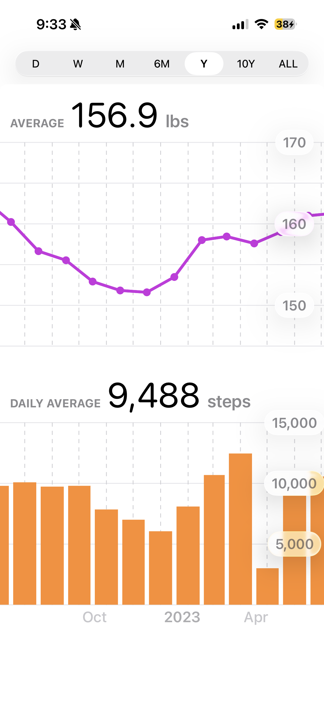

# Health History

An iOS app that charts your Apple Health data across longer time ranges than the built-in Health app allows.

## Motivation

The Apple Health app caps its charts at one year of history. If you want to see how your weight trended over the last decade, or view your step count from day one, you're out of luck. Health History fixes that by adding **10Y** and **ALL** range options alongside the standard short-term views.

## Screenshot

## Features

- **Weight and step count** charts pulled from HealthKit
- **Seven time ranges**: D · W · M · 6M · Y · 10Y · ALL
- **Drag to pan** within any range (except ALL) to scroll through history
- Adaptive bucketing — the ALL range automatically picks the right granularity (hourly → daily → weekly → monthly → yearly) based on how much data you have
- Summary stats: average weight and daily average step count for the visible window
- Background preloading of adjacent ranges for instant switching
- Read-only HealthKit access — the app never writes health data

## Tech

- SwiftUI + Swift Charts
- HealthKit (`HKStatisticsCollectionQuery`)
- Requires iOS 18+ (uses `glassEffect` and `ContentUnavailableView`)
